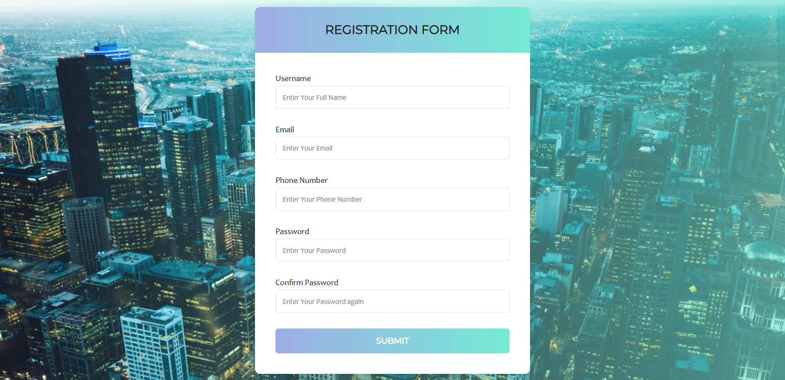

<h2 align="center">🅵🅾🆁🅼 🆅🅰🅻🅸🅳🅰🆃🅸🅾🅽</h2>
<h2 align="center">This Is Simple Form Validation</h2>

## INFO😁:-
<ul>
<li>LANGUAGE USED:- HTML, CSS, JAVASCRIPT</li>
<li>SOFTWARE:- VS CODE</li> </ul>

<h4>❣WATCH THE DEPLOYED VERSION ON https://yakshit-22.github.io/Form_Validation/ ❣</h4>

## Feel Free To Fork This Repo.(●'◡'●) And Please Support Me By Giving Star..🎇
